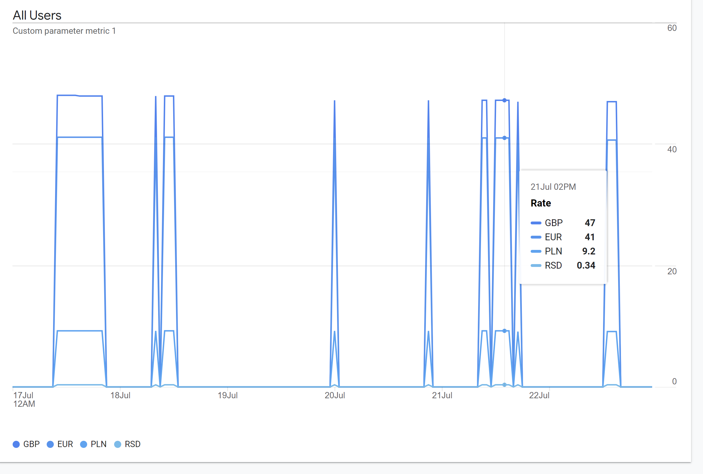

# Gamp

Sends NBU [current exchange rates](https://bank.gov.ua/NBUStatService/v1/statdirectory/exchange?json) to Google Analytics. 

```
docker build . -t gamp:0.0.1
docker run --name gamp -d -e API_SECRET={API_SECRET} -e MEASUREMENT_ID={MEASUREMENT_ID} -e CLIENT_ID={CLIENT_ID} gamp:0.0.1
```

Explore chart: https://analytics.google.com/analytics/web/#/analysis/p395123037/edit/eE6-kTDCQ-62Yb1J1IP1Lg
